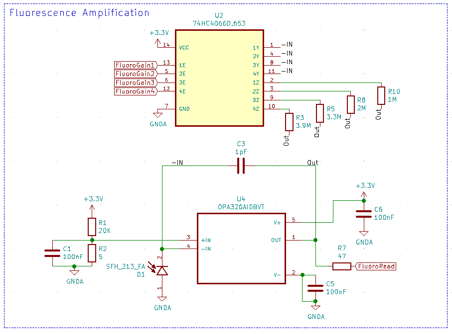
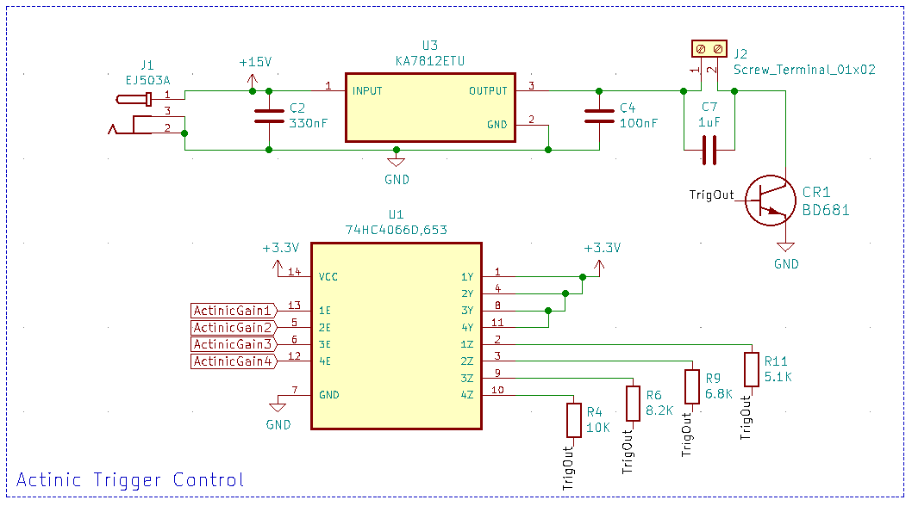

<p align="center">
  
</p>

### Description

Open-JIP is an open-source chlorophyll *a* fluorometer used to quantify photosynthetic phenotypes in terrestrial plants and microalgae. It is controlled via a Teensy microcontroller and features highly customisable electrical components and a 3D-printed infrastructure. 

#### OJIP

Open-JIP utilises a technique known as the fast polyphasic rise fluorescence (also known as OJIP). Steady irradaince is provided from an emitting LED, this excites photosynthetic antenna in the sample resulting in excess irradiance being emitted as photons of a longer wavelength (i.e. fluorescence). The emitted fluorescence, which contains information regarding the state of photosynthesis, is captured by a photodiode, amplified by the custom circuitry and stored by the Teensy microcontroller. 

The transient captured by Open-JIP gives the user an indication of the state of photosynthesis in the subject organism to varying levels of complexity. If you would like to know more about the theory surrounding the measurement of chlorophyll *a* fluorescence, this [link](https://doi.org/10.1016/j.algal.2020.102105) gives a basic introduction and resources for further reading.

### Publication

The original device which used an Arduino Mega was published in [Photosynthesis Research in 2019](https://doi.org/10.1007/s11120-019-00673-2):

*A guide to Open-JIP, a low-cost open-source chlorophyll fluorometer - Bates et al. 2019*

If you would like to see what the device is capable of, you may be interested in this recent [publication](https://doi.org/10.1016/j.algal.2020.102105) which uses Open-JIP as a flow-through chlorophyll *a* fluorometer connected [a custom photobioreactor](https://github.com/HarveyBates/Phenobottle) with the microalga *Chlorella vulgaris*.

### Collaborations and custom architecture 

If you would like to collaborate on a project, or would like to see if Open-JIP can be customised to suit your application, please email me at [harvey_bates@hotmail.com](mailto:harvey_bates@hotmail.com). 

### Future of Open-JIP

Since the publication of Open-JIP a number of changes have been made to increase the devices capabilities. These include:

1. Adjustable fluorescence protocols
2. Ability to change detection sensitivity dynamically (though software)
3. Adjustment of actinic LED intensity dynamically (through software)
4. Improvements in resolution
5. Improvements in number of datapoints in each OJIP transient

***

# USER MANUAL

Below contains the user manual for Open-JIP, if you have any questions there is a discussions tab in this github repository, where I will do my best to get back to you as soon as possible.

## Contents

1. Introduction
   1. Specifications
   2. Getting started
      1. Downloading files
         1. Method 1 (New users)
         2. Method 2 (Experienced users / collaborators)
      2. Gathering materials
         1. Printed circuit board (PCB)
            1. Ordering PCB
         2. 3D models
         3. Additonal parts
2. Firmware / Software
   1. Introduction
   2. Arduino IDE / Teensyduino
   3. Basic operations
   4. Python control
   5. Advanced operations
      1. Change actinic LED intensity
      2. Change detection sensitivity
      3. Set analog reference voltage & Resolution
3. Hardware
   1. Detection
   2. Actinic Intensity

## 1. Introduction

### Specifications

| Feature            | Value / Description                                          |
| ------------------ | ------------------------------------------------------------ |
| Actinic LED Colors | **Blue** 455 – 485 nm (466 nm), **Green** 517 – 555 nm (532 nm), **Orange** 583 – 600 nm (593 nm), **Red** 617 – 635 nm (626 nm). |
| Resolution         | 10 to 16-bit (optimised for 12-bit)                          |
| Sampling rate      | 8 &mu;s at 12-bits                                           |
| Operating voltage  | 15 V 1.2 A (Barrel plug)                                     |
| Communications     | USB (Serial)                                                 |
| Microcontroller    | Teensy 3.5/3.6 or Teensy 4.1 (3.6 Recommended)               |
| Actinic Intensity  | Four intensities (Low, Mid, High, Very High)                 |
| Detection (Gain)   | Four settings (Low, Mid, High, Very High)                    |

### Getting started

#### Downloading files

##### Method 1 (New users)

New users should naviage to the [releases](https://github.com/HarveyBates/Open-JIP/releases) page to find the most recent (and stable) version of the device. You can download the latest release as a `.zip` file and this will contain all the files you need to get the device up and running. 

##### Method 2 (Experinced users / collaborators)

If you want to contribute to the project or fork this directory feel free to do so, just know that I constantly update files here so they may not function as expected before release. 

To clone this directory type this into your terminal / console.git clone 

```bash
git clone https://github.com/HarveyBates/Open-JIP.git
```

#### Gathering materials

Open-JIP can be built in an afternoon if you have all the equipment at hand. The folder "Bill of Materials" contains all the materials needed to build Open-JIP. This has been divided into two parts; (1) circuit board and (2) other. 

In addition to the Bill of Mateirals you will need to have access to:

1. A soldering iron
2. Solder (Paste or wire variety)
3. A reflow oven (not nessesary but makes the circuit board easier to assemble)
4. A 3D-printer
5. A pair of wire strippers / cutters
6. Some tweesers

##### Printed circuit board (PCB)

In the ```Bill of Materials/Circuit Board``` folder you will find a table all the components needed to construct the Open-JIP circuit board. These components can be bought from common electronics suppliers such as [digikey](https://www.digikey.com/), [LCSC](https://lcsc.com/en) or [farnell](https://au.element14.com/) etc. Links for each component is provided.

Note that most of the comonents are suface mount (SMD), this is due to their increased reliablity and in my opinion its easier to assemble SMD compared to through-hole (THT) components. 

###### Ordering a PCB

To order the circuit board I recommend using [JLCPCB](https://jlcpcb.com/) as they are cheap, easy and ship fast. 

1. Open the folder titled Electronics and compress the housed Gerber files into a ```.zip``` file. 
2. On the JLCPCB website drag and drop the ```.zip``` file into the order form. 

The default settings are sutiable and you will receive 5 circuit boards for around $30 AUD. 

##### 3D Models

The 3D-models used for 3D-printing Open-JIP can be found in the ```Open-JIP/3D Models``` folder. Two file types are specified:

1. ```.stl``` can be directly imported into 3D-printing software such as [Ultimaker-Cura](https://ultimaker.com/software/ultimaker-cura) or sent to a local 3D-printing manufactuer.
2. ```.STEP``` is the modifiable Open-JIP 3D-model and as such can be configured whichever way you want before being exported as a ```.stl``` file. You can use 3D modeling software to do this such as [Fusion360](https://www.autodesk.com/products/fusion-360/overview) or [Solidworks](https://www.solidworks.com/).

##### Additonal parts

In addition to the above electronics you will need a few components such as a Teensy microcontroller, power supply, computer to use the device etc. A table of all these additional items can be found in the folder location ```Bill of Materials/Other```.

## 2. Firmware / Software

### Introduction

Open-JIP operates via a computers serial port (USB connection), the user sends commands in the form of strings that are read by the Teensy microcontroller. This results in the device taking a measurement or other tasks. You can do this manually though the Arduino IDE or by using scripts in various languages. 

### Arduino IDE / Teensyduino

To setup the Teensy (upload the firmware to the microcontroller) you will need **both** [Arduino IDE](https://www.arduino.cc/en/software) and [TeensyDuino](https://www.pjrc.com/teensy/teensyduino.html) if running on Linux or Windows, or just [TeensyDuino](https://www.pjrc.com/teensy/teensyduino.html) if using a Mac. Instructions on how to do this is provided in the above links. 

When first using Open-JIP: 

1. Plug the Teensy into your computer
2. Open Arduino IDE
3. Select ```Tools>Board>Teensy 3.6``` (may be in another part called Teensyduino)
4. Select ```Port>"Your Teensy Device"```
5. ```File>Open``` the "Teensy.ino" file found in ```Firmware/v0.3/Teensy_3.6/Teensy_3.6.ino```
6. ```Sketch>Upload``` to flash the file onto the Teensy

The povided ```Teensy.ino``` file will work as is, but if you wish to change settings in this file you will need to reupload the firmware to the Teensy again after changes have been made.

### Basic Operations

To take a measurment open the serial monitor (in the Arduino IDE when the deivce is connected to your computer) (```Tools>Serial Monitor```) and type in the command ```MF``` (denoting **m**easure **f**luorescence). This will (in the default configuration) take a one second measurement of chlorophyll *a* fluorescence and print the resulting measurments out into the serial monitor. You can copy and paste the data into excel in order to graph the transient.

There are a number of included functions that require the same method to operate:

#### Basic functions

1. ```MF``` - **M**easure fluorescence. Measure the chlorophyll *a* fluorescence signature of the organism of interest. 
2. ```CP``` - **C**alculate **p**arameters. Calculate and print out basic fluorescence parameters from the most recent OJIP curve. 
3. ```CFo``` - **C**alibrate **F<sub>o</sub>** (the minimum level fluoresence). Provides short flashes of illumination for calibrating the minimum level fluorescence. This command is useful if you want to know if your measurment is going to *saturate* (due to an overly concentrated sample) before taking a measurment. 
4. ```An``` - **A**ctinic intensity (irradiance of LED) where ***n*** is a number between 1 and 4 (lowest to highest).
5. ```Fn``` - **F**luorescence gain (sensitivity of detection) where ***n*** is a number between 1 and 4 (lowest to highest).

**Note** - It is reccomended that the minumum level of fluorescence (F<sub>o</sub>) is greater than 0.3 V for the maximum stability of acquisitions.

#### Advanced functions

1. ```MJ``` - **M**easure **J**-step. Measures up to the J-step (~2 ms) and returns the data to the serial port.
2. ```MW``` - **M**easure **w**ave. Measures up to the J-step multiple times with set time intervals between acquisitions. 

#### Calibration funcitons

1. ```ML``` - Calibrate actinic intensity (**m**easure **l**ight). Turns on the actinic LED for a period of three seconds to allow the intensity to be measured by a 4&#960; light meter.
2. ```Cr``` **C**alibrate **r**ise time of the actinic LED/amplifier combination. Provides some short  (100us) flashes of illumination from the actinic LED to calibrate your setup using an external oscilloscope. Useful if you want to ensure your Fo value is accurate (i.e. Fo should be measured when the actinic LED and amplifier are stable (usually around 40us)). *Note* this is only nessesary if you alter the default electronics configuration (see below).  

### Python Control

Open-JIP comes with an external cross platform python script that allows users to take basic measurments, plot the data and sort it into a ```.csv``` file automatically. This program is located under ```External Control/Open-JIP.py```.

```Open-JIP.py``` uses [plotly](https://plotly.com/python/) to plot the data and [pyserial](https://pyserial.readthedocs.io/en/latest/pyserial.html) to access the serial port of your machine. You must have [python](https://www.python.org/) installed to use this script. **This program runs in the terminal / console**. Additonally you need pip to install these requirements as follows:

```bash
cd Open-JIP/External Control
pip3 install -r requirements.txt
python3 Open-JIP.py
```

If the above doesn't work, try this instead:

```bash
cd Open-JIP/External Control
pip install -r requirements.txt
python Open-JIP.py
```

If you wish to change the output path of the ```.csv``` file you can do so by changing this string in ```Open-JIP.py```:

```python
fileName = "Open-JIP_Data.csv"  # Filename of output .csv file
```

### Advanced operations

A major feature of Open-JIP is its customisability. In the firmware users can adjust:

1. The actinic LED intensity
2. The detection sensitivity
3. The analog reference voltage
4. Resolution of the device
5. Length of actinic pulse

This next section is going to be in reference to the files located within ```Firmware/v0.3/Teensy_3.6```.

#### Change actinic LED intensity

In ```actinic.cpp``` the actinic LED intensity can be adjusted. There are four possible configurations, LOW, MID, HIGH, VERY HIGH. These can be selected by applying the values 1 - 4 (LOW - VERY HIGH) when switching on the actinic LED. 

```C++
void Actinic::on(){
  switch(intensity){
    case 1:
      digitalWrite(actinicGain4, HIGH); // Low
    	break;
    case 2:
      digitalWrite(actinicGain3, HIGH); // Mid
      break;
    case 3:
      digitalWrite(actinicGain2, HIGH); // High
      break;
    case 4:
      digitalWrite(actinicGain1, HIGH); // Very high
      break;
  }
}
```

*Note-* that a switch statment is used here as this process is time sensitive, the actinic LED must switch on as fast as possible to resolve Fo. 

*DO NOT -* combine actinic LED intensities as this will result in undefined behaviour. 

#### Change detection sensitivity

In ```sensitivity.cpp``` the detection sensitivity can be adjusted. There are four possible detection configurations, LOW, MID, HIGH, VERY HIGH (1 - 4). These are set before starting an exposure for stability and are therefore defined by the user.

```C++
void Sensitivity::define(int _gain){
  switch(_gain){
    case 1:
      digitalWrite(fluoroGain1, HIGH); // Low (high chl concentration)
      break;
    case 2:
      digitalWrite(fluoroGain2, HIGH); // Mid
      break;
    case 3:
      digitalWrite(fluoroGain3, HIGH); // High
      break;
    case 4:
      digitalWrite(fluoroGain4, HIGH); // Very high (low chl concentration)
      break;
  }
}
```

 *DO NOT* - combine gain settings as this will result in undefined behaviour. 

#### Set analog reference voltage & Resolution

In ```fluorescence.cpp``` the reference voltage can be adjusted to either 3.3 or 1.1 volts when using a Teensy 3.6. The purpose of this is (1) the Teensy 3.6 (1.1 V) reference voltage is more stable than 3.3 V and (2) you can attain a higher resolution when measuring weak fluorescence signals.

```C++
void Fluorescence::set_reference_voltage(float voltage){
  // Sets and initalises the required reference voltage for measurments
  if(voltage == 3.3){
    analogReference(DEFAULT); // Set to 3.3 V
  }
  else if(voltage == 1.1){
    analogReference(INTERNAL1V1); // Set to 1.1 V
  }
  else{
    analogReference(DEFAULT); // Set to default (3.3 V) if unknown value is found
  }
  analogRead(readPin); // Initalise reference voltage
}
```

*Note* - This is usally done statically at the start of the program by adjusting the value of ```refVoltage``` to either 3.3 or 1.1 depending on your requirements.

The number of bits for each reading can be changed via this command in the ```void setup()``` function:

```c++
analogResolution(12); // 12-bit resolution
```

*Note* - **Increasing** the resolution **decreases** the sampling rate so if you want to get alot of data points around Fo I reccomend you use a 12 or 10-bit resolution.

If you use have a 12 bit-resolution with a reference voltage of 1.1V the finest sensivitiy of the device is 0.00027 V per-division (1.1V / 2<sup>12</sup>) at a 8 &mu;s sampling rate. 

#### Defaults

Upon startup, Open-JIP will revert to its default configuration. You can change this by altering the setup command in ```Teensy_3.6.ino```:

```C++
void setup() {
  Serial.begin(115200); // Starting baud rate
  analogReadResolution(12); // Default resolution
  pinMode(13, OUTPUT); // Sets the microcontrollers LED pin as an output
  
  sensitivity.refresh(); // Switch off all sensitivity settings
  sensitivity.define(1); // Set a default sensitivity (1 - 4)

  actinic.off(); // Switch off all actinic settings
  actinic.define(1); // Set a default actinic irradiance (1 - 4)
}
```

#### Length of actinic pulse

In ```fluorescence.h``` the length of the actinic exposure (pulse) can be adjusted. The acquisition is done in two steps; (1) the fast measurments (readings every 8 &mu;s) and (2) slow (readings every 1 ms). These arrays require different processing methods and are therefore stored seperately. Below gives you an idea of how the array lengths are calculated for the intial aqusitions and the converted output. 

```c++
// Microsecond (micro) = readings every 8 us
  int microLength = 1000; // Equals length of microread array
  int microRead [1000]; // Stores microsecond readings 
  int milliRead[1000]; // Stores millisecond readings

// Millisecond (milli) = readings every 1 ms
  int milliLength = 1000; // Equals length of milliread array
  float microTime[1000]; // Stores microsecond timestamps
  float milliTime[1000]; // Stores millisecond timestamps

// Stores final array in converted form (i.e. Volts and Milliseconds)
  float fluorescenceValues[2000];
  float timeStamps[2000];
```

*Note* - If you are using the ```Open-JIP.py``` script you will need to change the number of datapoints that are read to match the length of ```fluorescenceValues```:

```python
timeStamps, fluorescenceValues = measure_fluorescence(2000) # Match with teensy script array length
```

## 3. Hardware

Open-JIP operates using a Teensy 3.6 microcontroller connected to a custom printed circuit board (PCB). The circuit is divided into two parts:

1. Detection - Responsible for detecting emitted fluorescence
2. Actinic intensity - Responsible for turning on and off the actinic LED

### Detection

Fluorescence dection is acheived with the use of an operational amplifier (op-amp) connected as a transimpedance amplifier. The inverting input is connected to a photodiode, while the non-inverting input is connected to a voltage divider to provide a very small offset voltage. The concept of the offset voltage is that the amplifier (op-amp) will respond faster to changes in voltage. 

<p align="center">
  
</p>

#### Gain adjustment

Four different sensitivies are provided though the use of a CMOS switch (74HC4066D) which has a range of different feedback resistors (1M, 2M, 3.3M and 3.9M). These resistors are all 0805 SMD. The gain is selected in the firmware of Open-JIP; however, if you wish to adjust the senstivity futher you can do so by changing one or more of these resistors. 

**Increasing** the resistance of the feedback resistor will **increase** the sensitivty of detection.

**Decreasing** the resistance of the feedback resistor will **decrese** the sensitivty of detection.

*Note* - if you begin to get a large overshoot occuring at the start of your measurements you may need to increase the capacitor value (C3) to 2pF - 5pF. This [article](https://wiki.analog.com/university/courses/electronics/electronics-lab-1st) may help you if you encounter this issue.

### Actinic intensity

The actinic LED is controlled in the same way as the detection circuit i.e. Using a CMOS switch to controll its brightness. Again four levels of brightness can be selected in the firmware and are controlled by resistors (10K, 12K, 15K, 20k) connected to the base of the darlington transisitor (BD681). Adjusting the value of these resistors will result in the LED getting brighter or dimmer based on their resistance value.

<p align="center">
  
</p>

The input voltage (15 V) is filtered through a 12 V linear voltage regulator. This regulator ensures the actinic LED is stable of the measurement. A small capacitor (C7 - 1 &mu;F) is placed across the LED's terminal to prevent overshoot. If you want the LED to respond faster you can reduce the value of this capacitor while using an oscilloscope to check the devices rise-time. 

**Increasing** the resistors results in **decreased** actinic brightness.

**Decreasing** the resistance of R10 results in **increased** actinic brightness.

***

### Licence

The software in this work is licensed under GNU AFFERO GENERAL PUBLIC LICENSE Copyright (C) (2020) (Harvey Bates)

This program is free software: you can redistribute it and/or modify it under the terms of the GNU General Public License as published by the Free Software Foundation, either version 3 of the License, or (at your option) any later version.

This program is distributed in the hope that it will be useful, but WITHOUT ANY WARRANTY; without even the implied warranty of MERCHANTABILITY or FITNESS FOR A PARTICULAR PURPOSE. See the GNU General Public License for more details.

You should have received a copy of the GNU General Public License along with this program. If not, see https://www.gnu.org/licenses/

For more information contact: [harvey_bates@hotmail.com](mailto:harvey_bates@hotmail.com)

<a rel="license" href="http://creativecommons.org/licenses/by-sa/3.0/"></a>

The hardware (3D Models, Electronic Schematics) in this work is licensed under a [Creative Commons Attribution-ShareAlike 3.0 Unported License](http://creativecommons.org/licenses/by-sa/3.0/).

[https://doi.org/10.1016/j.algal.2020.102105]: 
[https://pyserial.readthedocs.io/en/latest/pyserial.html]: 